# Lab 1: RCE via web shell upload
## Lab Description:

    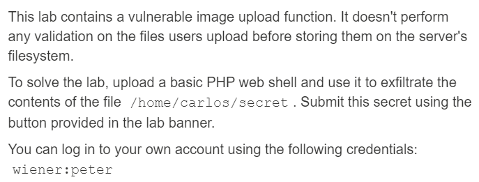

## Summary:
* Lỗ hổng ở phần upload ảnh và không có tí kiểm duyệt nào
* Để solve lab, upload một PHP web shell và lấy nội dung của file /home/carlos/secret
* Cho trước tài khoản: wiener:peter

## Solution:
* Đăng nhập vào tài khoản được cung cấp

    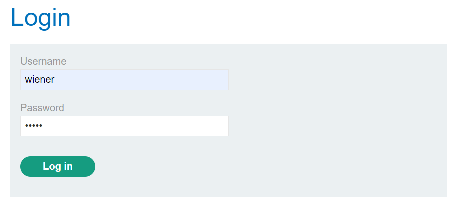

* App chuyển hướng tới My Account. Có mục upload file thay ava, chọn 1 file ảnh bthg, thấy hiển thị file được upload thành công và ảnh đã thay đổi

    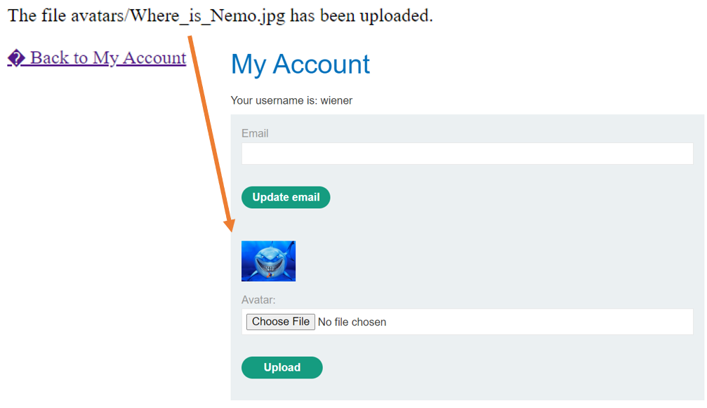

* Vào Proxy/HTTP History của Burp, thấy một request có dạng như sau:

    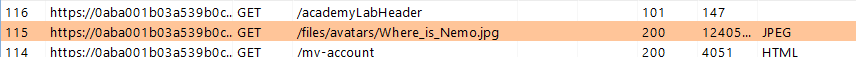

* Tạo một file PHP với nội dung là:

    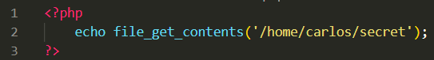

❗Hàm ***file_get_contents(file_name)***: dùng để đọc toàn bộ nội dung file, trả về nội dung dưới dạng một chuỗi (file_name thường có dạng là địa chỉ tuyệt đối)

* Upload file PHP đấy lên ava, hiển thị file upload thành công. Dùng Burp xem response trả về thấy được chuỗi sau:

    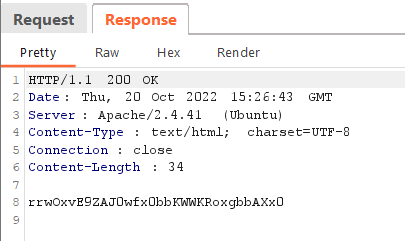

* Lấy chuỗi submit solution, và lab được solved

  

# Lab 2: Web shell upload via Content-Type restriction bypass
## Lab Description:

    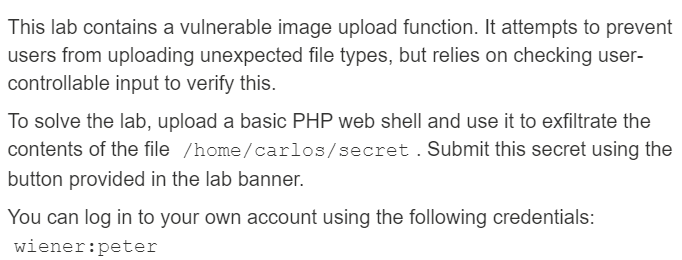

## Summary:
* Lỗ hổng ở phần upload file ảnh, và đã có một chút kiểm duyệt ở file type nhưng phụ thuộc vào trường nhập mà user có thể kiểm soát được
* Để solve lab, upload một PHP web shell và phát tán nội dung của file /home/carlos/secret
* Cho trước tài khoản: wiener:peter
## Solution:
* Tương tự lab trước, nhưng đến khi thử upload webshell.php thì file không gửi được và lỗi hiển thị như sau:

    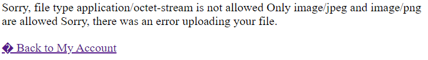

* Bật Burp interception lên, gửi lại webshell. Bắt request đó rồi dưới phần request body, sửa Content-Type thành image/jpg. Lần này web không hiển thị lỗi nữa, mà còn upload thành công

    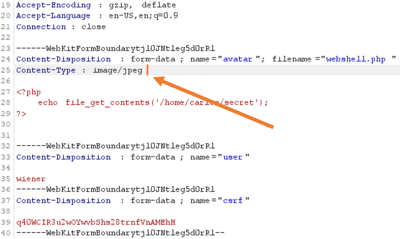

* Do file được upload thành công, vào HTTP History tìm response trả về, nhận được chuỗi. Nhập chuỗi và lab được solved

  

# Lab 3: Web shell upload via path traversal
## Lab Description:

    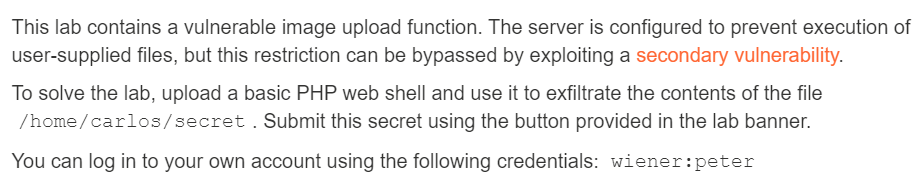

## Summary:
* Lỗ hổng ở phần upload file ảnh, server đã được cấu hình để ngăn thực thi các files do người dùng upload
* Để solve lab, upload một PHP web shell và phát tán nội dung của file /home/carlos/secret
* Cho trước tài khoản: wiener:peter

## Solution:
* Giống các lab trước, ta upload webshell vào mục file ảnh. Nhưng lần này web trả về upload thành công

    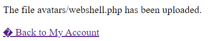

* Xem response trả về trong Proxy/HTTP history, ta chỉ thấy trong body là plain text nội dung của webshell

    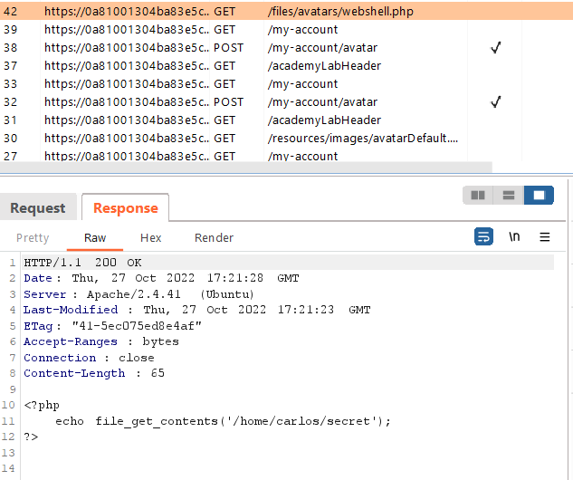

* Ta thử đổi tên của file thành tên khác. Tìm request có dạng POST trong HTTP request rồi ném nó sang Burp Repeater
* Dưới phần body của request, ở phần liên quan đến webshell của mình, thêm chuỗi traversal để thành "../webshell.php" thì nhận được response với dòng thông báo giống ban đầu. Có thể đoán được là server đã lọc chuỗi traversal ra khỏi filename

    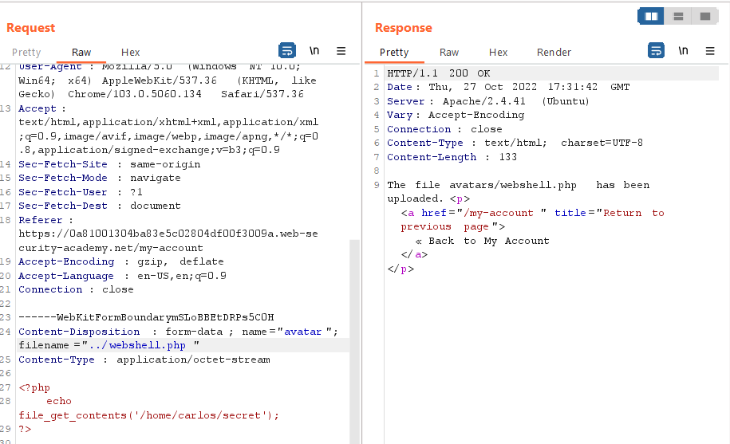

* Không bỏ cuộc, ta mã hóa URL chuỗi traversal thành "..%2f", thay lại vào filename, ta đã thấy chuỗi traversal trong tên ở response

    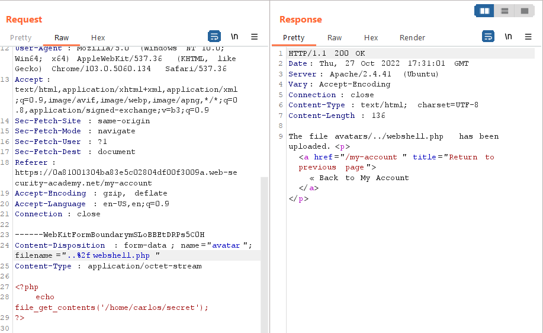

* Quay trở lại trình duyệt rồi load lại trang. Xong bật lại Burp lên xem HTTP request, tìm request có dạng sau: GET /files/avatars/..%2fwebshell.php. Xem response nó trả về thì thấy nội dung của file, nhập chuỗi và lab đã được solved

    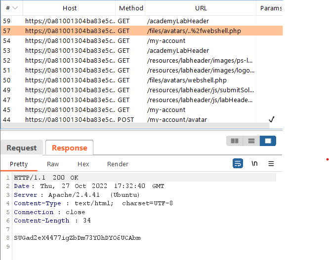

  

# Lab 4: Web shell upload via extension blacklist bypass
## Lab Description:

    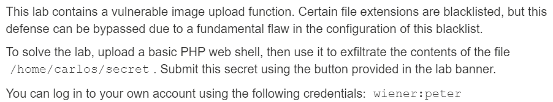

## Summary:
* Lỗ hổng ở phần upload file ảnh, một vài ext đã bị cho vào blacklist
* Để solve lab, upload một PHP web shell và phát tán nội dung của file /home/carlos/secret
* Cho trước tài khoản: wiener:peter
## Solution:
* Giống các lab trước, ta upload webshell vào mục file ảnh. Nhưng lần này web trả về lỗi do ext không hợp lệ

    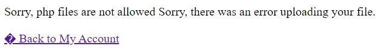

* Lần này ta tạo một file khác có tên là .htaccess với nội dung như sau:

    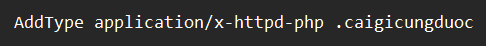

* Câu code trên giúp map ext .caigicungduoc tới một MIME type thực thi được là application/x-httpd-php
* Sau đó upload file ht.access đó lên, ta nhận được upload thành công

    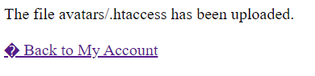

* Sau đó ta quay trở lại cái request POST lúc upload webshell lên và đổi filename thành webshell.caigicungduoc, ta nhận được phản hồi upload thành công

    

* Sau đó về xem phản hồi của webshell, thấy trả về nội dung file, nhập chuỗi và lab đã được solved

    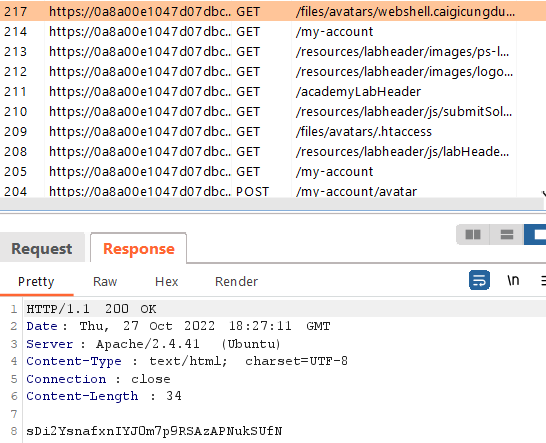

# Lab 5: Web shell upload via obfuscated file extension
## Lab Description:

    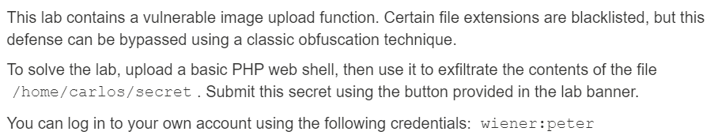

## Summary:
* Lỗ hổng ở phần upload file ảnh, một vài ext đã bị cho vào blacklist
* Để solve lab, upload một PHP web shell và phát tán nội dung của file /home/carlos/secret
* Cho trước tài khoản: wiener:peter

## Solution:
* Vẫn như lab cũ, upload webshell, nhưng lần này response trả về yêu cầu chỉ ext là .jpg hoặc .png mới được upload

    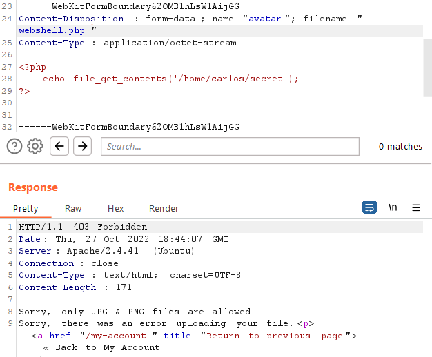

* Đổi filename thêm null byte và .jpg thành webshell.php%00.jpg, nhận được phản hồi upload thành công. Có thể thấy filename đã bị lược đi .jpg ở cuối và null byte đã làm tên file chỉ còn webshell.php

    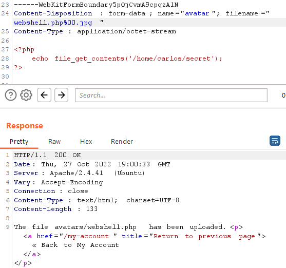

* Load lại trình duyệt, xem phản hồi trả về, nhập chuỗi, và lab đã được solved

    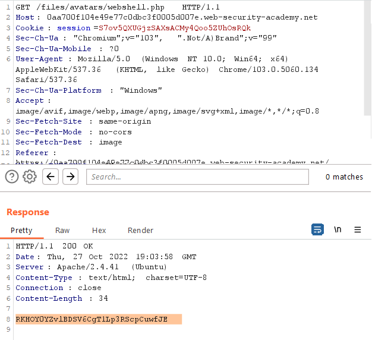

