# Lab 1: File path traversal in the most simple case
## Lab Description:

    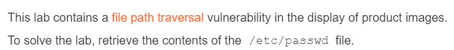

## Summary:
* Lỗ hổng ở phần hiển thị ảnh và app ***chả sử dụng gì*** để phòng thủ cả
* Để solve lab, đọc content của /etc/passwd

## Solution:
* Mở lab ra, ta chỉ có giao diện bình thường như các lab khác

    

* Bật Burp lên, rồi chọn ***một item bất kỳ để bắt request***. Request đầu tiên có được có một param tên ***productId***

    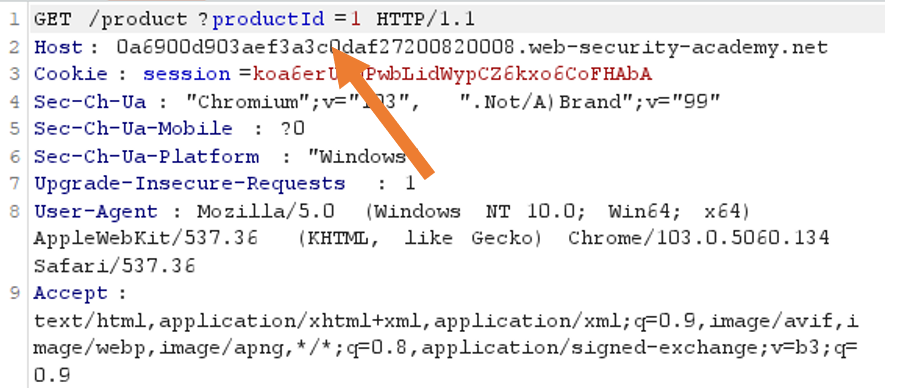

* Thử thay giá trị param thành ../../../etc/passwd nhưng không có gì và ***nhận được lỗi***

    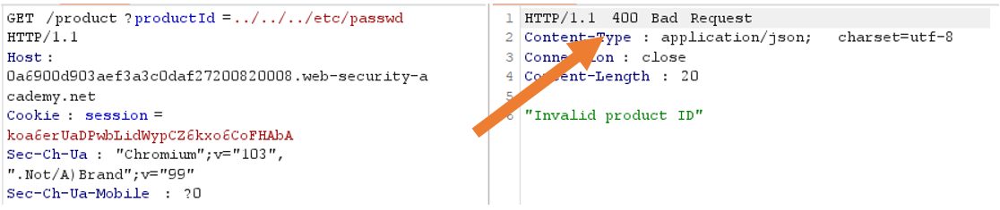

* Không bỏ cuộc, ta vẫn còn bắt được một request nữa. Ở đây, chúng ta có một param nữa tên là ***filename***

    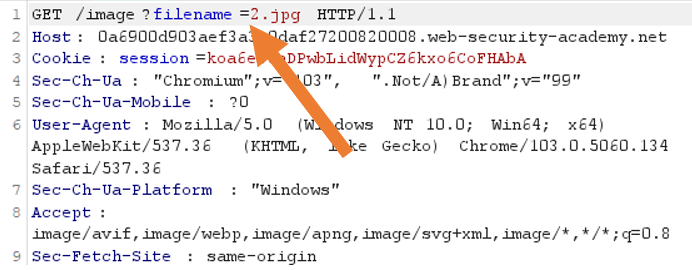

* Thử thay giá trị param thành ***../../../etc/passwd***, và chúng ta nhận được kết quả trả về là nội dung của file, vậy lab đã được solved

  

# Lab 2: File path traversal, traversal sequences blocked with absolute path bypass (Bypass bằng đường dẫn tuyệt đối)
## Lab Description:

    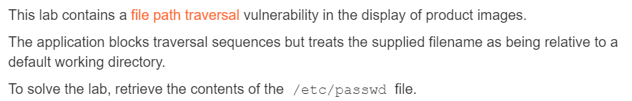

## Summary:
* Lỗ hổng ở phần hiển thị ảnh. App đã ***lọc chuỗi traversal*** nhưng lại coi filename nhập vào là ***tương đối*** so với cái directory gốc hiện tại
* Để solve lab, đọc content của /etc/passwd

## Solution:
* Giống lab trước nhưng khi thay giá trị param của filename, ta hiển thị lỗi không tìm thấy file

    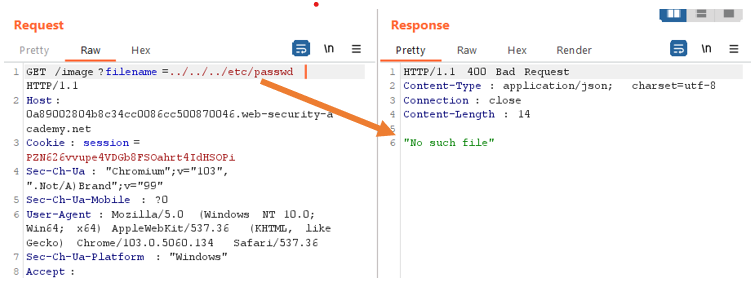

* Thử thay param bằng ***đường dẫn tuyệt đối*** là ***/etc/passwd***, ta nhận được nội dung của file, và lab được solved

    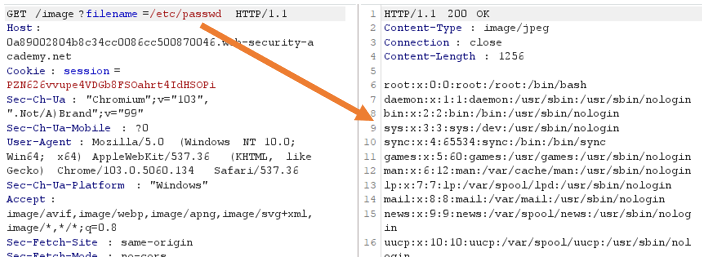

  

# Lab 3: File path traversal, traversal sequences stripped non-recursively
## Lab Description:

    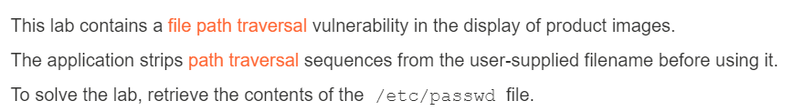

## Summary:
* Lỗ hổng ở phần hiển thị ảnh. App đã ***lọc các chuỗi traversal*** có trong filename
* Để solve lab, đọc content của /etc/passwd

## Solution:
* Giống các lab trước, nhưng lần này khi nhập cả đường dẫn tuyệt đối cũng không ăn thua

    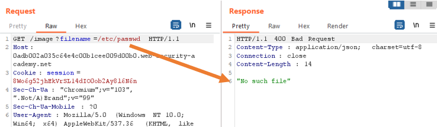

* Thử thay param bằng ***chuỗi traversal lồng nhau*** là ***....//....//....//etc/passwd***, ta nhận được nội dung của file, và lab được solved

    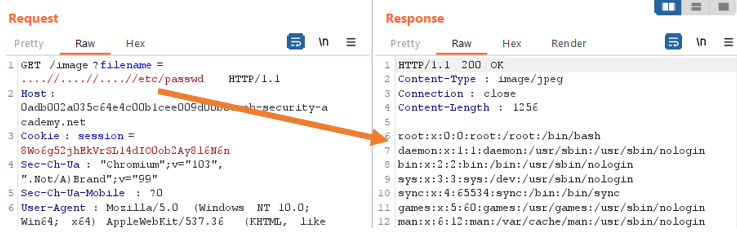

  

# Lab 4: File path traversal, traversal sequences stripped with superfluous URL-decode
## Lab Description:

    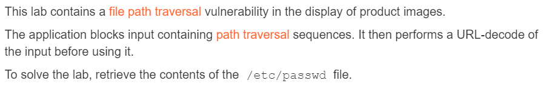

## Summary:
* Lỗ hổng ở phần hiển thị ảnh. App đã sử dụng ***URL-decode*** vào input trước khi sử dụng nó
* Để solve lab, đọc content của /etc/passwd

## Solution:
* Giống các lab trước, nhưng lần này do input đã được áp dụng URL-decode lên, ta phải ***mã hóa URL*** input (sử dụng kt.gy cho nhanh)
* Mã hóa ../../../etc/passwd thành ***..%2F..%2F..%2Fetc%2Fpasswd*** nhưng thay vào thì lại có lỗi

    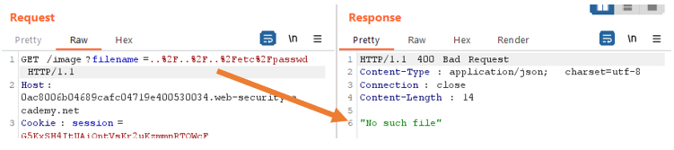

* Mã hóa URL một lần nữa được chuỗi ***..%252F..%252F..%252Fetc%252Fpasswd***, thay vào thì hiển thị được nội dung file, và lab đã được solved

    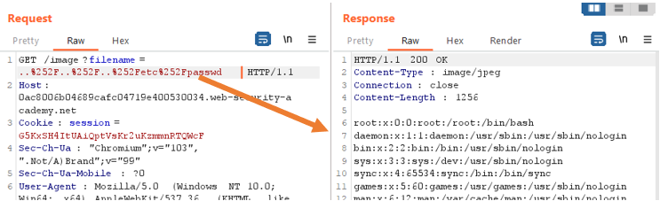

  

# Lab 5: File path traversal, validation of start of path
## Lab Description:

    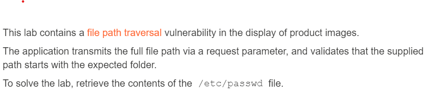

## Summary:
* Lỗ hổng ở phần hiển thị ảnh. App truyền toàn bộ đường dẫn qua tham số request tới, và đảm bảo rằng đường dẫn bắt đầu bằng một directory nào đó
* Để solve lab, đọc content của /etc/passwd

## Solution:
* Tương tự các lab, khi bắt request, ta nhận được param filename, nhưng ở đây lại có dạng sau:

    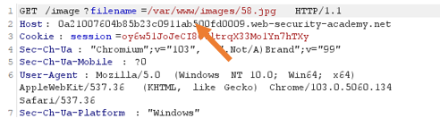

* Có thể đoán được ảnh được lưu ở trong /var/www/images/, mà app lại yêu cầu đường dẫn phải bắt đầu bằng một directory nào đó, thì đoán được có thể đây là directory mà app yêu cầu
* Thay giá trị param thành /var/www/images/../../../etc/passwd, ta hiển thị được nội dung file, và lab đã được solved

    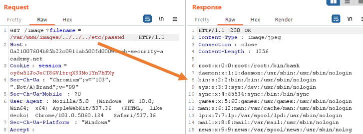

  

# Lab 6: File path traversal, validation of file extension with null byte bypass
## Lab Description:

    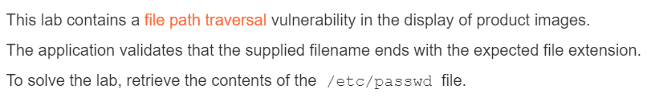

## Summary:
* Lỗ hổng ở phần hiển thị ảnh. App đã đảm bảo giá trị của filename phải có ext nhất định nào đó
* Để solve lab, đọc content của /etc/passwd

## Solution:
* Tương tự, ta bắt request và nhận được param filename. Nhưng do app đã yêu cầu filename phải có giá trị kết thúc bằng một ext nhất định nào đó, ta không thể tiếp cận giống các lab đã làm
* Lần này, ta sử dụng null byte vào giá trị, tức là ../../../etc/passwd%00.jpg để khử ext đi, ta nhận được nội dung file, và lab đã được solved

    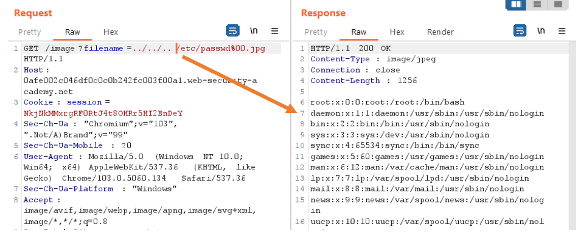

❗Giải thích: giá trị null byte sau khi được mã hóa URL sẽ là ***%00***. Do hầu hết trong các app khi được viết dưới dạng ngôn ngữ bậc cao như PHP, Perl, Java, ... thì đều có lúc cần thực hiện lệnh dưới dạng ngôn ngữ bậc thấp như C/C++ vì nó có thể liên quan đến hệ thống. Mà trong C/C++ thì null byte là ***string termination point/delimiter character*** (ký tự chấm dứt chuỗi, hiểu nôm na là vậy), tức nó sẽ làm cho việc xử lý chuỗi dừng ngay lập tức. Ở lab này, do app kiểm tra file ext ở cuối có đúng định dạng ảnh không bằng cách kiểm tra 4 ký tự cuối (thông thường là vậy), do vậy ta chỉ cần thêm .jpg là vượt qua được khâu kiểm duyệt này. Nhưng file /etc/passwd.jpg thì không tồn tại (ít nhất mặc định của hệ thống là không), mà thông thường các app xử lý request lấy dữ liệu sẽ rà từ đầu đến cuối chuỗi (tức đến khi gặp null byte) để xem nguồn cần lấy rồi gửi về cho client, do đó chỉ cần thêm %00 đằng sau passwd, sau đó phần đằng sau là cái gì cũng không quan trọng do việc xử lý chuỗi sẽ kết thúc khi gặp null byte.