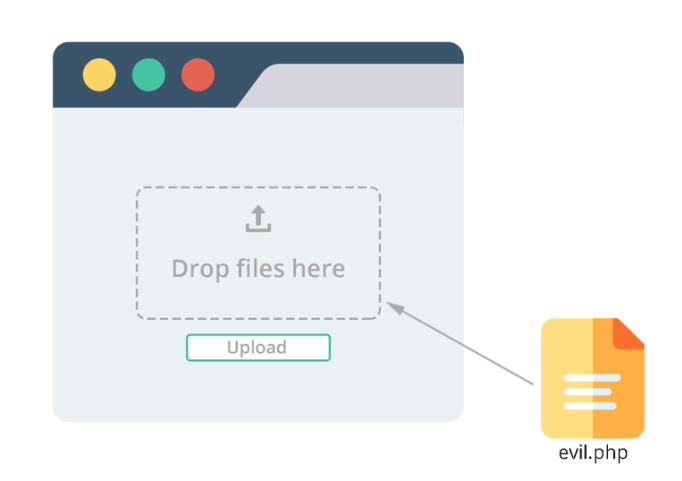
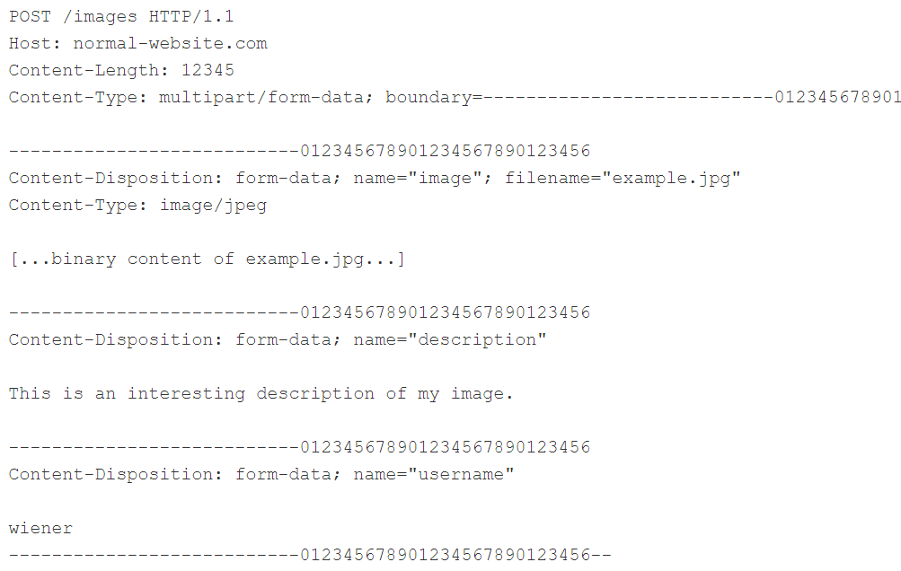
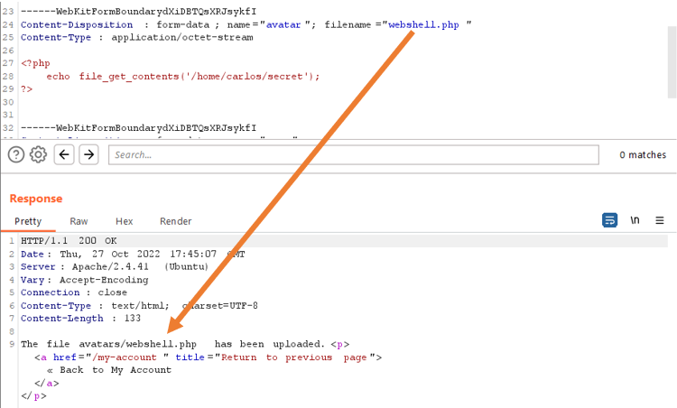
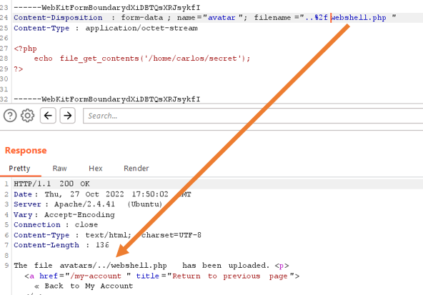

# I. Khái niệm File Upload Vulnerability
## Khái niệm Webshell
* Là một dạng ***mã độc*** có thể điều khiển máy chủ nào đó từ xa bằng cách gửi HTTP requests tới đúng endpoint
* Có thể được viết dưới nhiều loại ngôn ngữ, nhưng thường là ngôn ngữ mà web đang sử dụng (VD: PHP...)

## Khái niệm lỗ hổng File Upload

    

* Là lỗ hổng có thể khai thác được khi bên web server cho phép người dùng *__upload file__* lên hệ thống của server mà không triển khai các bước *__kiểm duyệt phù hợp__*
* Kẻ tấn công có thể upload *__server-side script__* hay webshells để thực hiện RCE
## Nguyên nhân dẫn đến lỗ hổng File Upload
* Khâu kiểm duyệt chưa được kiểm tra kỹ càng, dễ dàng bị bypassed
* Tạo ra *__blacklist__* (có thể là kiểm duyệt extension) nhưng không xét tới *__khả năng tương thích__* (tức extension có thể bị đổi)
* Một số *__tools__* có thể thay đổi vài thuộc tính của file khiến khâu kiểm duyệt có thể bị bypassed (Burp Proxy)
* Kiểm duyệt *__chưa toàn vẹn__*, tức kiểm tra một thành phần kỹ lưỡng nhưng những thành phần còn lại thì hời hợt

## Ảnh hưởng của lỗ hổng File Upload
* Các *__file hệ thống__* quan trọng có thể bị *__ghi đè__* lên nếu không kiểm duyệt tên file upload
* File upload với *__size quá lớn__* có thể chiếm hết không gian đĩa của hệ thống => gây ra *__DOS__*
* Trường hợp tệ nhất là khi *__file type__* không được kiểm duyệt cẩn thận, cấu hình của server cho phép *__thực thi__* các files đó (VD: .php, .jps) và dẫn tới RCE

 

# II. Cơ chế xử lý request các static files của server - cơ sở của File Upload Vulnerability
* Tuy hầu hết các website giờ rất *__dynamic__* (tài nguyên mà website lấy để phục vụ cho request ở đâu đó chứ không phân tích request path rồi lấy thông tin tương ứng trong filesystem), nhưng vẫn còn các *__request for static files__* (ảnh, stylesheet...)
* Để xử lý các requests for static files, server *__phân tích request path__* để xác định extension, sau đó xác định file type thật bằng cách đối chiếu với *__MIME types__*. Sau đấy tùy thuộc vào file type và cấu hình của server thì sẽ có những trường hợp sau:
    * *__Non-executable file type__* (ảnh, HTML): đẩy vào response rồi gửi cho client
    * *__Executable file type__* (php):
        * Nếu server được cấu hình để chạy file này, dựa vào các headers và parameters của request, biến số tương ứng sẽ được gán và *__script sẽ được chạy__*. Kết quả xử lý sau đó sẽ đẩy vào response rồi gửi cho client
        * Nếu server không được cấu hình để chạy file này thì sẽ phản hồi bằng *__lỗi hoặc plain text__*, nhưng vẫn có khả năng làm rò rỉ thông tin

 

# III. Cách khai thác
* Trong viễn cảnh xấu nhất, webshell được ***uploaded thành công*** lên server, và app cũng được config để ***thực thi*** code bên trong, từ đó kẻ tấn công hoàn toàn có khả năng kiểm soát toàn bộ server
## 1. Khai thác thông qua khâu kiểm duyệt chưa chặt chẽ
### a. Thông qua file type:
* Xét trường hợp app có mục upload ảnh, kèm description cho nó và tên người dùng dưới dạng form. Trình duyệt sẽ trả về một POST request có dạng như sau sau khi gửi:

    

* Phần body của request được chia thành nhiều phần khác nhau ứng với mỗi input, mỗi phần có một header ***"Content-Disposition"*** cho thông tin về input của nó và có thể có thêm header ***"Content-Type"*** (giống ở mục upload ảnh)
* Thông thường các websites sẽ kiểm duyệt file upload thông qua ***"Content-Type"*** để check xem có đúng MIME type hay không, nhưng nếu tin tưởng hoàn toàn vào giá trị của header này có thể dẫn đến việc bypass bằng Burp Repeater

### b. Ngăn chặn thực thi file ở trong những directories mà người dùng truy cập được:
* Ngoài ra các websites còn có cách phòng thủ khác là ***không cho thực thi*** scripts mà MIME type khác với những gì server cấu hình để thực thi. Nếu không thì sẽ trả về lỗi hoặc trả về plain text. Điều này tuy vô hiệu hóa việc tạo ra webshell lên server, nhưng có thể làm ***rò rỉ source code***
* Nhưng việc cấu hình này có thể ***khác nhau giữa các directories***. Những directories mà lưu trữ files người dùng upload lên thì thường có khâu kiểm duyệt chặt chẽ hơn. Nhưng nếu bằng cách nào đấy có thể upload lên một directory khác mà vốn không dùng để chứa file upload, server vẫn có khả năng thực thi được file đó
* Xét ví dụ dưới:

    

* File có tên là webshell.php được upload sẽ mặc định đi vào thư mục avatars/, nơi mà khâu kiểm duyệt được thực hiện rất chặt chẽ

    

* Sau khi đổi tên file như dưới, ta nhận được phản hồi là vậy, chứng tỏ file đã được upload lên thư mục cùng bậc với avatars/, nơi mà có thể khâu kiểm duyệt không còn chặt chẽ nữa

### c. Cho vào blacklist những file types nguy hiểm nhưng lại cho thiếu:
* Rõ ràng, cách để ngăn chặn webshell upload lên server là cho vào ***blacklist*** những files có ext như .php. Thói quen tạo blacklist vốn không được đầy đủ và chặt chẽ vì rất khó để chặn toàn bộ những file ext mà thực thi được code trong nó. Kẻ tấn công có thể dễ dàng bypass cái blacklist bằng cách ***dùng các ext khác tương tự, ít được biết đến hơn, song vẫn có thể thực thi được*** như .php5, .shtml...

***Ghi đè lên file cấu hình server:***
* Chỉ khi được cấu hình để thực thi file thì server mới làm thế. Ví dụ với server Apache, trước khi thực thi file PHP yêu cầu từ phía client, các devs cần phải cho đoạn code sau vào file /etc/apache2/apache2.conf:

LoadModule php_module /usr/lib/apache2/modules/libphp.so 
AddType application/x-httpd-php .php

* Apache server sẽ load cái cấu hình đó trong file có tên là .htaccess. Do vậy những file đó thường được dùng để ghi đè hoặc thêm các cài đặt tùy ý

***Sử dụng cái file ext "gây lú" (obfuscating file ext):***
* Giả sử khâu kiểm duyệt là case-sensitive (phân biệt chữ hoa chữ thường) thì nó sẽ không nhận ra .PhP là .php. Nhưng 
* Có một vài kỹ thuật "gây lú" khâu kiểm duyệt như sau:
    * Pha trộn ***nhiều ext***: ví dụ .php.jpg
    * Sử dụng ***mã hóa URL***: sử dụng khi khâu kiểm duyệt không decode nhưng bên server thực thi thì lại decode
    * Sử dụng ***dấu chấm phẩy*** hoặc ký tự ***null byte*** được mã hóa URL để dừng việc xử lý chuỗi (ở đây là xử lý filename)
* Những cách trên đều có cách phòng chống như loại bỏ các ext nguy hiểm trong filename

### d. Thông qua nội dung file
* Giả sử khi upload ảnh, server có thể sẽ xác nhận một vài đặc tính đặc trưng nhất của ảnh, ví dụ như là dimensions. Một file .php thì không thể có dimensions
* Tương tự, một vài file types luôn có những chuỗi bytes ở header hoặc footer, hay còn gọi là ***fingerprint/signature***. VD: jpeg luôn bắt đầu bằng FF D8 FF

    

* Đây được coi là cách hiệu quả để kiểm tra file type, nhưng đương nhiên không thể là hoàn toàn được. Có một vài tools như ***ExifTool*** có thể tạo ra code bẩn bên trong metadata của một file ảnh

### e. Thông qua race conditions:
* Ngày nay các frameworks càng ngày càng dày dặn kinh nghiệm. Thông thường các file uploads sẽ được cho vào một ***directory tạm thời*** nào đó, sau đó được ***đổi tên*** đi để tránh việc ghi đè vào các file hiện tại, sau đó thực hiện các ***khâu xác thực*** rồi mới chuyển đến đích cuối
* Dẫu thế, không phải ông dev nào cũng dùng framework và thích code thuần tay, do đó có khả năng tạo ra ***race conditions*** cho phép kẻ tấn công bypass được các khâu kiểm duyệt được cho là chặt chẽ nhất

***Race condition** (theo techtarget.com): là một tình huống xảy ra khi thiết bị hoặc hệ thống cố gắng thực hiện hai hoặc nhiều tác vụ nào đó **cùng một lúc**, mà đáng lẽ ra **theo nguyên tắc** chúng phải được thực hiện theo một **tuần tự nhất định** nào đó*
* Ví dụ, có một vài websites upload file trực tiếp lên hệ thống file chính, sau đó remove nó đi nếu nó không đáp ứng được yêu cầu xác thực. Hành vi này quá là phổ biến và tiêu biểu cho các websites sử dụng phần mềm anti-virus để check malware. Điều này tuy chỉ tốn vài mili giây, nhưng chỉ cần sự tồn tại ngắn ngủi trong server như thế, kẻ tấn công vẫn có thể bằng cách nào đấy thực thi được nó

## 2. Khai thác mà không cần đến RCE
### a. Upload Client-side script:
* Client-side script là những script tấn công phía client
* Ví dụ: upload HTML files hoặc SVG images có thể dùng tag <script\> để tạo XSS payloads. Do vậy khi file đó được đăng lên một trang nào đó và khi người dùng khác truy cập vào, trình duyệt của họ sẽ thực thi script đấy khi render trang

### b. Khai thác thông qua phân tích thành phần của các files đã uploaded:
* Có thể thực hiện XXE injection attack

## 3. Sử dụng PUT method cho request
* Một vài webs vẫn còn được cấu hình cho PUT request, tạo cơ hội để kẻ tấn công upload code bẩn

 

# IV. Cách phòng chống:
* Kiểm tra extension bằng *__whitelist__* thay vì blacklist
* Phân tích kỹ *__filename__* để tránh *__Traversal Attack__*
* *__Rename file__* upload để tránh bị ghi đè
* Xử dụng *__framework__* xử lý file upload đã được kiểm thử chuẩn thay vì tự code 
 

# Tài liệu tham khảo
<input type="checkbox"> https://portswigger.net/web-security/file-upload#:~:text=What%20are%20file%20upload%20vulnerabilities,type%2C%20contents%2C%20or%20size  
<input type="checkbox"> https://owasp.org/www-community/vulnerabilities/Unrestricted_File_Upload  
<input type="checkbox"> https://dummytip.com/penetration-testing-step-3-file-upload-vulnerabilities-la-gi/  
<input type="checkbox"> https://viblo.asia/p/khai-thac-cac-lo-hong-file-upload-phan-1-aWj53L6pK6m  
<input type="checkbox"> https://viblo.asia/p/lo-hong-file-upload-3P0lPnMbKox
