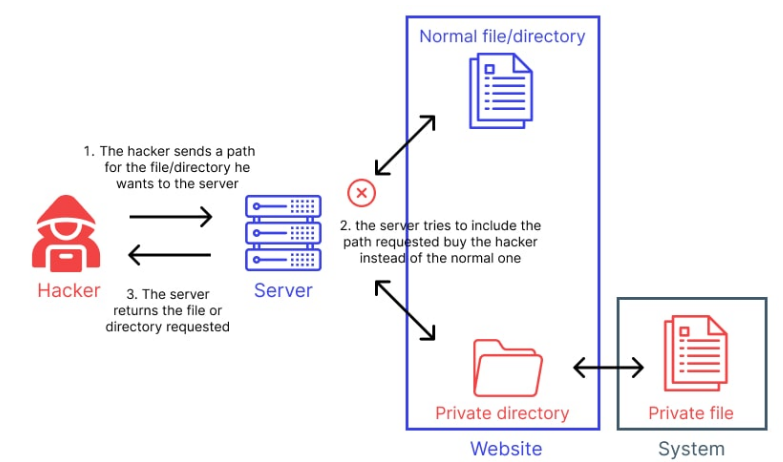

# Khái niệm Path Traversal Attack
* Tên gọi khác: Directory Traversal
* Là một lỗ hổng cho phép kẻ tấn công ***đọc được file trong server*** như source code, dữ liệu, file hệ thống, file dữ liệu người dùng... bằng cách điều chỉnh giá trị của các param lấy dữ liệu qua các ***chuỗi traversal*** "../" hoặc "..\\" (trên Windows)

    

  

# Một số cản trở khi khai thác lỗ hổng Path Traversal
* Web/App thực hiện ***loại bỏ/lọc các chuỗi traversal*** từ filename mà người dùng nhập
    * Có thể bị bypassed bằng cách sử dụng ***đường dẫn tuyệt đối***, hoặc sử dụng ***chuỗi traversal lồng nhau*** ("....//" hoặc "..\/") vì cuối cùng sau khi lọc xong thì trở về chuỗi traversal bình thường

* Có khi trong URL path hoặc param ***filename*** của multipart/form-data request, web đã lược bỏ toàn bộ chuỗi traversal trước khi tham số được truyền vào
    * Vẫn có thể bị bypassed bằng cách sử dụng ***URL encoding*** (mã hóa URL), hoặc ***double URL encoding*** chuỗi traversal thành %2e%2e%2f hoặc %252e%252e%252f. Ngoài ra Burp cũng có một ***list payloads*** có sẵn với nhiều dạng chuỗi traversal đã được mã hóa khác nhau

* App yêu cầu ***filename*** phải bắt đầu bằng ***base directory*** được định sẵn
    * Bypass được dễ dàng bằng cách ***chèn vào giữa*** các chuỗi traversal (giả sử base folder phải là /var/www/images):

filename=/var/www/images/../../../etc/passwd

* App yêu cầu file đọc phải kết thúc bằng ***file ext*** định sẵn
    * Bypass bằng cách sử dụng null byte để terminate việc xử lý chuỗi

filename=../../../etc/passwd%00.png

  

# Cách phòng tránh
* Cách hiệu quả nhất là không cho những trường input tạp bởi người dùng tói hệ thống file API
* Nếu cách trên không được thì có thể dùng "phòng thủ hai tầng":
    * Kiểm duyệt input người dùng trước khi thực thi nó bằng cách dùng whitelist, hoặc input chỉ chứa những nội dung trong tầm cho phép (chỉ chứa chữ và số)
    * Sau khâu kiểm duyệt thì gán input đó vào base directory và ***nền tảng hệ thống file API*** (???) để "chuẩn hóa" cái path

  

# Tài liệu tham khảo sưu tầm 
<input type="checkbox"> https://portswigger.net/web-security/file-path-traversal 
<input type="checkbox">https://owasp.org/www-community/attacks/Path_Traversal 
<input type="checkbox">https://viblo.asia/p/tan-cong-path-traversal-va-cach-thuc-phong-thu-bJzKmO7wl9N 
<input type="checkbox">https://www.acunetix.com/blog/articles/path-traversal/ 